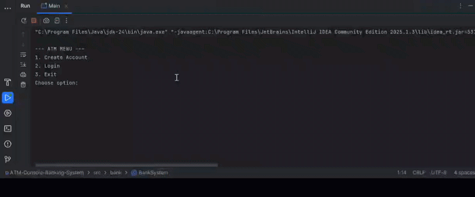

ATM Console Banking System

A simple console-based banking system written in Java.
It allows users to create accounts, log in, deposit, withdraw, and check balances. Accounts are stored persistently in a file.

Features

- Create a new account (with unique account number)
- Login with account number and PIN (4 digits)
- Deposit money
- Withdraw money (checks for sufficient balance)
- Check current balance
- Stores all account data in `accounts.txt` for persistence

Demo

How to Run

1. Open the project in IntelliJ IDEA.
2. Run the `Main.java` file.
3. Use the menu to create accounts, login, and perform transactions.

Folder Structure

ATM-Console-Banking-System/
├─ src/
│  └─ bank/ (Account.java, BankSystem.java, Main.java)
├─ images/
│  └─ demo.gif
├─ accounts.txt
├─ README.md
├─ .gitignore
├─ ATM-Console-Banking-System.iml
├─ .idea/

Notes

- PIN must be 4 digits.
- Account numbers must be unique.
- All transactions are reflected in the balance and stored persistently.